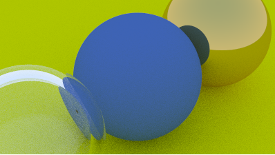

# RAY TRACER
Latest  renderization



## About
The current project consists in creating a simple Ray Tracer with vanilla C++ by following the article [Ray Tracing in One Week](https://raytracing.github.io/books/RayTracingInOneWeekend.html).

At the start of the project, i'm injecting values onto a [PPM](https://netpbm.sourceforge.net/doc/ppm.html) image file to create the images processed by the Ray Tracer.

For this project i'm also making use of [CMake](https://cmake.org/) for builds. You can find the executable file in ```build/Debug/``` directory of the repository if you want.

## Future Plans
Even though the main premise of this project is to complete the article stated above, i also want to upgrade the base ray tracer made with additional perks, and also switch the PPM files to a more interactive visualization scheme.

I also want to better the performance of the final ray tracer making the most use i can from the GPU with the help of API's such as [OpenGL](https://www.opengl.org/) or [Vulkan](https://www.vulkan.org/).

## Extra
This is **my first dive into Graphics programming** and tools like [CMake](https://cmake.org/) and [Vulkan](https://www.vulkan.org/). Because of that, the code **won't certantly be the most sophisticated or the best written**, but this project is made with the intention of **documenting the adventure of creating a Ray Tracer**. However, i'm always open to constructive criticism.

While updating the project **i'll try as much as possible to share all the materials** used to study the Math and Physics behind Ray Tracing, as well as other materials i found important while doing the project. I'm doing this not only to keep my study organized but to also help anyone who wants to take the journey of making a Ray Tracer, or start Graphics Programming as a whole.

## Materials
- [Ray Tracing in One Week](https://raytracing.github.io/books/RayTracingInOneWeekend.html)
- [A Pixel is not a little square](https://www.researchgate.net/publication/244986797_A_Pixel_Is_Not_A_Little_Square_A_Pixel_Is_Not_A_Little_Square_A_Pixel_Is_Not_A_Little_Square)

## Tools
- [CMake](https://cmake.org/)

*By @hasuru*